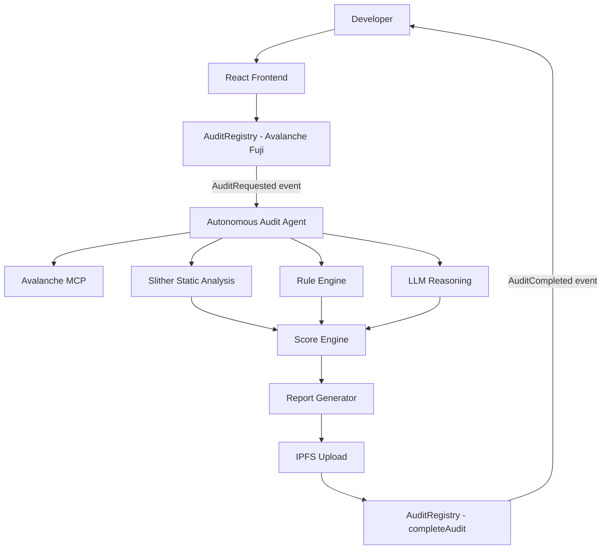

# Decentralized Audit Oracle

**Autonomous smart contract security settled on Avalanche.**

An autonomous smart contract auditor that receives jobs on-chain, analyzes contracts using static analysis + AI reasoning, and settles cryptographically verifiable security results directly on Avalanche.

## Problem

Smart contract security audits are expensive, slow, and inaccessible to most developers. There is no transparent, automated, on-chain mechanism to request, execute, and verify preliminary security assessments.

## Solution

Decentralized Audit Oracle provides an autonomous audit pipeline:

1. Developer requests audit on Avalanche (pays fee in AVAX)
2. AI Agent detects the request via on-chain event
3. Static analysis (Slither) + deterministic rules + LLM reasoning
4. Report uploaded to IPFS with integrity hash
5. Score and report CID settled on-chain
6. Auditor withdraws payment

## Why Avalanche

Avalanche is not superficially attached — it is the core coordination layer:

| Role | How Avalanche is used |
|------|----------------------|
| **Payment** | Developer deposits audit fee in AVAX |
| **Coordination** | `AuditRequested` event triggers the AI agent |
| **Settlement** | Agent sends `completeAudit()` transaction |
| **Integrity** | Score + report hash stored immutably |
| **Transparency** | Anyone can query completed audits |
| **Machine Economy** | Agent wallet receives compensation |

## Architecture



## How it Works

### Two on-chain transactions per audit

```
TX 1: Developer → requestAudit() → AVAX enters registry
      Event: AuditRequested

TX 2: AI Agent → completeAudit() → Score + CID + Hash on-chain
      Event: AuditCompleted
```

### Audit Pipeline

```
Static Analysis (Slither)
       +
Deterministic Rule Engine
       +
LLM Enrichment
       ↓
Score Engine (deterministic)
       ↓
Report (JSON + Markdown)
       ↓
IPFS Upload → CID
       ↓
keccak256(report) → reportHash
       ↓
completeAudit(score, CID, hash) → Avalanche
```

## Avalanche MCP Integration

The Avalanche MCP server is used as a read-only source of authoritative Avalanche context and public blockchain information for the auditing agent.

Transactions are intentionally signed independently using the agent wallet because the hosted Avalanche MCP server is read-only.

## Smart Contracts

| Contract | Purpose |
|----------|---------|
| `AuditRegistry` | Registry, payments, settlement |
| `VulnerableVault` | Demo contract with intentional vulnerabilities |
| `SafeVault` | Demo contract with best practices |

## Security Score

Deterministic scoring:

```
Start: 100
Critical: -30
High: -15
Medium: -7
Low: -2
Info: 0
```

| Range | Level |
|-------|-------|
| 90-100 | EXCELLENT |
| 75-89 | GOOD |
| 60-74 | MODERATE |
| 40-59 | HIGH RISK |
| 0-39 | CRITICAL RISK |

## Installation

```bash
npm install
```

## Environment Variables

Copy `.env.example` to `.env`:

```bash
cp .env.example .env
```

See `.env.example` for required variables.

## Local Development

```bash
# Terminal 1: Start local node
npm run node

# Terminal 2: Deploy contracts
npm run deploy:local

# Terminal 3: Run tests
npm run test
```

## Fuji Deployment

```bash
# Set environment variables in .env
# DEPLOYER_PRIVATE_KEY, AUDITOR_PRIVATE_KEY, FUJI_RPC_URL

npm run deploy:fuji
```

## Running the Agent

```bash
cd agent
npm install
npm run start
```

## Running the Frontend

```bash
cd frontend
npm install
npm run dev
```

## Demo

See `docs/demo-script.md` for the full demo walkthrough.

## Security Considerations

- This is an automated preliminary security assessment
- Does NOT replace professional smart contract audits
- LLM analysis is supplementary to deterministic analysis
- Score reflects detected issues, not guaranteed absence of vulnerabilities

## Limitations

- Static analysis cannot detect all vulnerability classes
- LLM may produce false positives/negatives
- Bytecode-only analysis is less precise than source analysis
- Score algorithm may be refined in future versions

## Future Roadmap

- Multiple auditor agents with consensus
- Reputation system and staking
- Auditor slashing mechanism
- DAO governance
- ZK proof attestation
- x402 machine-to-machine payments
- Continuous monitoring
- Stablecoin payments

## Hackathon

Built for ETH Bolivia Buildathon 2026 — Build with Avalanche bounty.

## License

MIT
